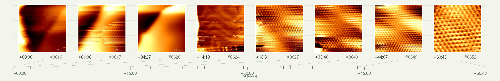
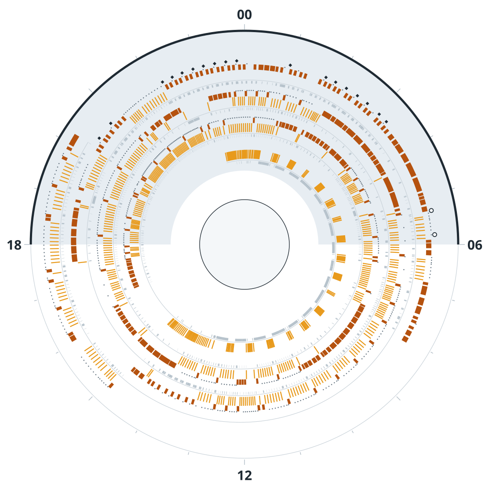
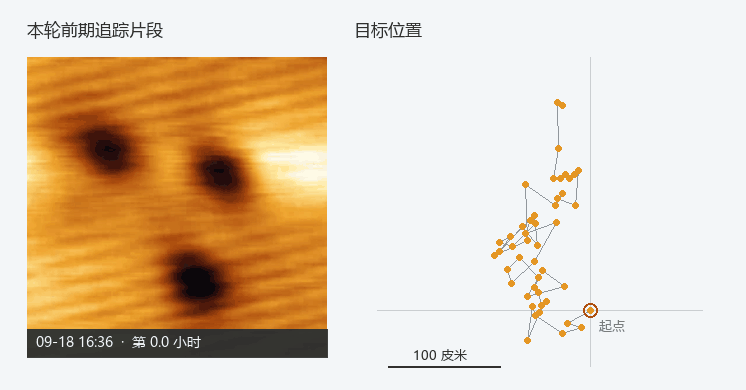
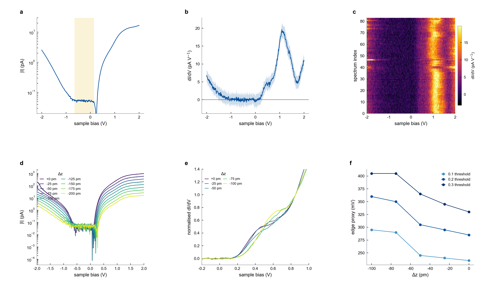
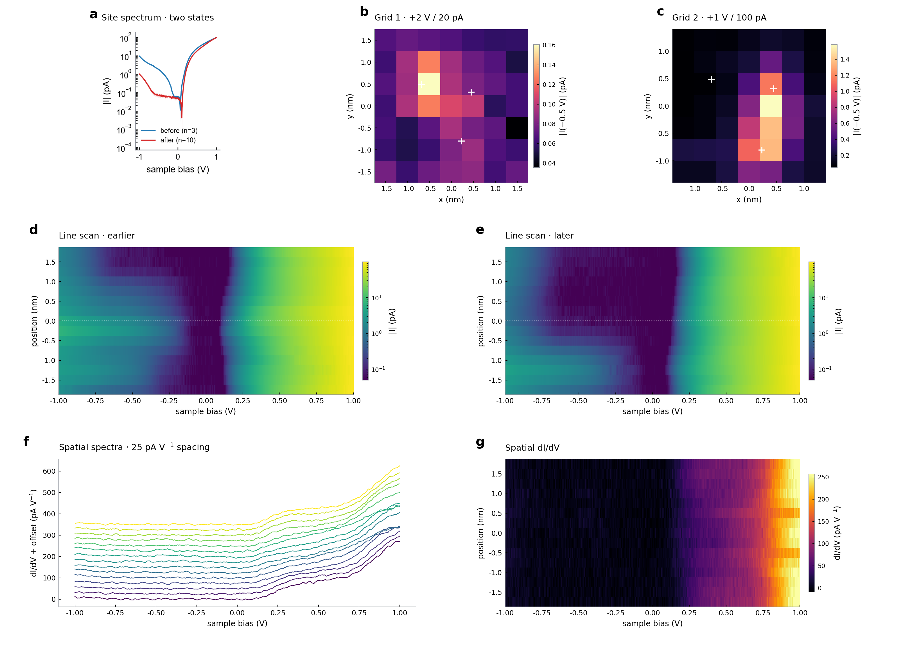
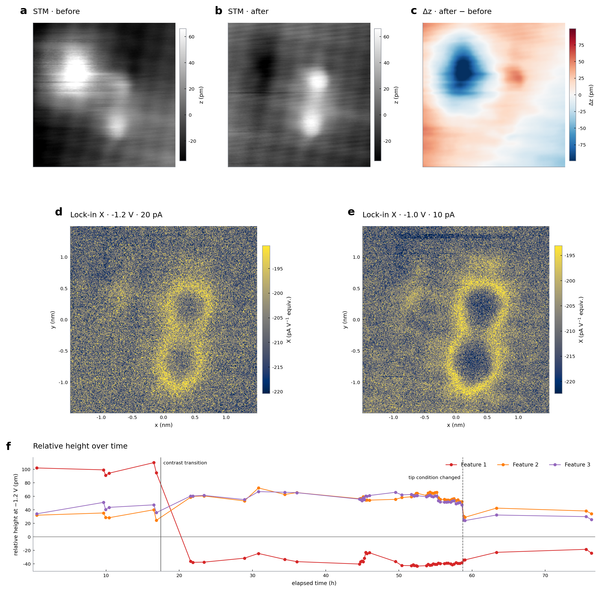

# MAST — Modular Autonomous SPM Toolkit

**English** · [中文](README.zh.md)

**Enabling AI to observe, reason, act, and test the consequences in real experiments at the atomic scale.**

MAST connects multi-agent collaboration, instrument control, visual observation, data analysis, and an operator interface
for scanning tunneling microscopy (STM). It turns experimental intent into physical actions with execution constraints,
state feedback, and opportunities for operator intervention.
Its central question is how AI can keep acquiring trustworthy data and advancing an experiment when the instrument's state is only partly visible and actions can change the system being measured.

   

**Two separate real-instrument demonstrations are featured below: tip repair on Au yielding atomically resolved STM images, and a completed MAST 6.4.0 campaign with nearly 100 hours of timestamped records.**
These deployments are reported by the maintainer. The `/api/ext/v1` interface and accompanying MCP integration
introduced in MAST 6.5.0 have passed software tests; hardware validation remains pending.
The sections below distinguish the scientific challenges of STM, MAST's engineering, and the scope of each validation claim.

## What is STM?

A scanning tunneling microscope uses **quantum tunneling** to study surfaces. A conductive tip is brought close to a sample
that supports a measurable tunneling channel. An applied bias drives a tiny current through the barrier between tip and sample.
As the tip scans point by point, a feedback system typically adjusts its height to maintain a set current,
producing images with atomic-scale resolution. Binnig and colleagues reported early surface studies using this method in 1982.
See the [original paper](https://doi.org/10.1103/PhysRevLett.49.57) and, for an introduction,
[Wikipedia: Scanning tunneling microscope](https://en.wikipedia.org/wiki/Scanning_tunneling_microscope).

STM images contain information about both surface geometry and electronic structure. Varying the bias and recording current
or differential conductance enables scanning tunneling spectroscopy (STS), which probes local electronic states at selected positions.
Interpreting differential conductance as the sample's local density of states requires assumptions about the tip, tunneling barrier,
temperature, and measurement conditions. A spectrum cannot automatically be treated as an intrinsic material property.
See the [Tersoff–Hamann theory](https://doi.org/10.1103/PhysRevB.31.805) for the theoretical basis.

### The instrument conditions behind atomic-scale precision

Low-temperature, ultrahigh-vacuum STM for low-energy electronic states and quantum materials combines several extreme conditions
at a very small tunneling junction. The scales below illustrate the operating principles; actual conditions depend on the sample,
measurement objectives, and instrument calibration.

| Characteristic | Why it matters |
|---|---|
| **An extremely narrow tunneling junction** | Tip and sample are typically separated by only a few ångströms, or fractions of a nanometer. Current depends approximately exponentially on this distance: minute displacements provide high sensitivity but can also change the signal substantially. |
| **Very low currents** | Common imaging currents range from picoamperes to nanoamperes, approximately $10^{-12}$ to $10^{-9}$ A. Preamplifiers, grounding, cabling, and bandwidth jointly determine whether these weak signals can be read reliably. |
| **Low and ultralow temperatures** | Kelvin and millikelvin conditions reduce thermal broadening and support studies of low-energy states. Cooling, thermal equilibration, and control of electron temperature are themselves instrument engineering challenges. |
| **Ultrahigh vacuum (UHV)** | UHV supports clean surfaces, tip preparation, and long measurements by reducing contamination from residual-gas adsorption. It does not guarantee that the tip remains unchanged during operation. |
| **Low mechanical and electrical noise** | Vibration isolation, acoustic isolation, electromagnetic shielding, and filtering suppress junction motion and electrical disturbances. Radio-frequency noise can also affect electron temperature and spectroscopic resolution. |
| **High stability over long periods** | Spectroscopic maps and repeated measurements require comparable tip conditions and spatial registration over hours or longer. Thermal drift, piezoelectric creep, and tip changes can break that correspondence. |

For typical imaging currents, see the [STM overview in this review of single-molecule measurements](https://doi.org/10.1021/nn103298x).
Published instruments demonstrate these requirements in practice. Song and colleagues achieved subpicometer junction stability
at a base temperature of 10 mK. Schwenk and colleagues discuss thermalization, radio-frequency filtering, and microelectronvolt energy
resolution in ultralow-temperature spectroscopy. See the [10 mK scanning probe facility](https://www.nist.gov/publications/10-mk-scanning-probe-microscopy-facility)
and [instrument design for high energy resolution](https://doi.org/10.1063/5.0005320).
These are specifications of the instruments in the cited papers, not performance claims for MAST.
STM can also operate at room temperature, in air, or in liquids; low temperature and UHV are not requirements for every STM.

## Why is STM one of the “crown jewels” of AI for experimental science?

**We see autonomous STM as one of the most demanding and representative challenges in AI for experimental science.**
It brings atomic-scale perception, physical reasoning, precision control, fault diagnosis, and experimental design into a single loop.
“Crown jewel” expresses a judgment about its research value, rather than a universal ranking of scientific instruments by difficulty.

### A partly observable physical system that actions can change

The crucial hidden variables are the **atomic configuration, chemical state, and electronic states of the tip apex**.
During routine STM operation, the directly available images, spectra, and currents reflect the combined tip–sample response,
not the true state of the apex itself. Inferring that state from these signals generally has no unique solution:
different tip–sample combinations can produce similar observations.
Judgments about tip condition therefore remain **evidence-constrained but uncertain guesses**. Additional observations can test
or rule out some explanations without uniquely recovering the actual microscopic configuration.

This unknown state also changes with operation: scanning, pulses, or contact can rearrange the apex or transfer material to it,
altering image contrast and spectroscopic response. An autonomous system must retain uncertainty about the tip state
and judge the suitability of its next action under that uncertainty.
Research on atom manipulation in real STM experiments has explicitly identified spontaneous tip changes, unknown manipulation
parameters, and the difficulty of accurately modeling tip–atom interactions. See [Chen et al., 2022](https://www.nature.com/articles/s41467-022-35149-w).

For autonomous experiments, these physical properties create five connected challenges:

| System property | What it means in STM | What an autonomous agent needs to do |
|---|---|---|
| **Partial observability** | The true microscopic tip state is not directly observable, and images and spectra generally cannot identify it uniquely. Multiple tip–sample states can produce similar observations. | Maintain several evidence-constrained hypotheses and continually test their plausibility; treat tip condition as an uncertain judgment, not an established fact. |
| **Strong nonlinearity** | Current varies exponentially with distance. Voltage, local electronic states, the barrier, and feedback jointly shape the response. A small parameter change can cross the boundary between imaging, manipulation, and contact. | Choose constrained actions using the current state and calibration; do not treat one successful parameter combination as a universal recipe. |
| **Nonstationarity** | Thermal drift and piezoelectric creep change actual position over time, while piezoelectric hysteresis makes the voltage–displacement relationship depend on the preceding drive trajectory. Adsorption and tip reconstruction also alter measurement response. Identical control commands cannot be assumed to retain a fixed correspondence to position and response. | Continually check position, drift, and measurement response; relocate, reassess, and adjust the strategy when needed. Do not rely indefinitely on one calibration or successful outcome. |
| **History dependence** | Earlier tip conditioning, pulses, contacts, adsorption, and material transfer leave different tip and surface states. Later experimental outcomes therefore depend on what the system has experienced. | Record actions, their order, timing, and outcomes; the same present parameter settings do not guarantee an identical physical state. |
| **Actions change the system** | Tip conditioning, atom manipulation, and local excitation deliberately alter the tip or surface. Measurement itself can disturb fragile objects. Tip rearrangements and atom transfer may be irreversible; restoring the parameters does not restore the previous state. | Weigh both the information an action can provide and its physical consequences, recheck measurement conditions afterward, and retain abort and operator-intervention paths. |

These properties overlap. Piezoelectric hysteresis also reflects history dependence; it is grouped here with creep and thermal drift
under nonstationarity to emphasize the difficulty of maintaining a stable correspondence between control inputs and actual coordinates or responses.

A simple approximation for distance sensitivity is $I \propto e^{-2\kappa z}$, where $z$ is the tip–sample separation and $\kappa$
is related to the effective tunneling barrier. This explains STM's high sensitivity, but does not fully describe an operating instrument:
real observations also depend on tip electronic states, the sample, bias, temperature, drift, and noise.
See [Tersoff–Hamann](https://doi.org/10.1103/PhysRevB.31.805) for the theory and
[research on scanner hysteresis and creep](https://doi.org/10.1063/1.4974271) for nonideal scanner responses.

We therefore view autonomous STM as a combination of **decision-making under partial observability, online system identification,
active learning, and precision control**. This is a modeling perspective: an agent uses observations and action history to form
tentative judgments about possible states and their plausibility, while choosing actions that both advance the experiment and test those judgments.
Such state estimation retains uncertainty; it does not mean reconstructing the true tip structure.
It is not a claim that a complete, accurate STM state model already exists, or that MAST implements every autonomous capability.

### The challenge is diagnosis, recovery, and scientific judgment

An image that looks good does not establish that the tip is suitable for the next spectroscopic measurement.
When a spectrum is anomalous, an experimenter must distinguish material electronic states from effects of tip states, charging,
tip-induced band bending, feedback, and noise. Different explanations may call for different controls: changing measurement conditions,
comparing scan directions, revisiting a reference area, or relocating and repeating a measurement after tip conditioning.
For example, studies of semiconductor surfaces have directly measured band bending caused by the tip's electric field;
see this [study of electrostatic tip–sample interactions](https://doi.org/10.1103/PhysRevLett.70.2471).
These are diagnostic approaches; any actual action depends on sample conditions, instrument constraints, and operating authorization.

The hard part is connecting these steps into reliable causal reasoning: detect an anomaly, propose possible causes, select observations
that distinguish them, check the outcome, and decide whether to continue, recover, repeat the measurement, or involve the operator.
**Autonomous scientific judgment must establish trust in the measurement conditions before interpreting the physics.**

Much operating expertise is tacit. An experienced experimentalist knows when to wait, which streaks merit concern, and what to verify
after tip conditioning. These judgments depend on context and must be translated into executable, verifiable workflows.
A general-purpose large language model may know STM principles, yet that knowledge alone does not provide the current tip state,
calibration, operating experience, or executable interface of a particular instrument.
Reviews of AI for scanning probe microscopy likewise identify reliance on expert experience, autonomous tip conditioning,
manipulation, and closed-loop experiments as important challenges. See [Li et al., 2026](https://doi.org/10.1016/j.asi.2026.100003).

### From individual automated tasks to closed-loop scientific experiments

Research has demonstrated concrete progress. In 2022, deep reinforcement learning enabled Ag atom manipulation in a real STM,
and path planning supported autonomous atom assembly. In 2025, a room-temperature STM study integrated tip and surface assessment,
atom recognition, area selection, drift correction, tip conditioning, and atom manipulation.
These results apply to specific materials and tasks; they do not establish general autonomous research on unknown samples.
See [Chen et al., 2022](https://www.nature.com/articles/s41467-022-35149-w) and
[Okuyama et al., 2025](https://doi.org/10.1021/acs.nanolett.5c04982).

A 2026 review of self-driving scanning probe microscopy discusses the progression from automated acquisition, real-time analysis,
and active learning toward discovery and manipulation. MAST aims to provide an inspectable engineering foundation for this direction,
connecting experimental knowledge, instrument interfaces, execution constraints, observations, and work records.
See [Narasimha et al., 2026](https://doi.org/10.1021/acs.accounts.6c00273).

The long-term goal is a scientific loop: **observe → propose a hypothesis → design controls → execute within constraints → check changes
to the instrument and sample → update the evidence → choose the next experiment**.
Ruling out artifacts, restoring trustworthy measurements, and testing physical hypotheses provide a stronger test of autonomy
than completing a single scan. STM's local environment and atomic-scale feedback make it a promising platform for evaluating
experimental intelligence. This is the project's research vision, not an already completed general-purpose “AI scientist.”

## MAST's results and validation

The two selected demonstrations differ in scale: a short Au tip-repair task and a separate, completed MAST 6.4.0 experiment. The latter's main event log covers approximately 99 hours. Complete datasets and logs are not included in this source release; the figures below are selected visual excerpts.
MAST 6.5.0 introduces `/api/ext/v1` and MCP integration. The new interface has passed software tests; hardware validation remains pending.

### Short demonstration: tip repair on Au

*An external agent repaired the tip on Au through an earlier MAST control path and obtained atomically resolved STM images. This is independent of the long experiment below.*

### Long demonstration: a nearly 100-hour STM record

In this separate campaign, the agent did more than write plans: at a real tunneling junction, it repeatedly relocated a drifting target, acquired spectra and images, and kept the experiment moving through communication faults. The researcher set scientific goals and time budgets and paused for liquid-nitrogen refills; the agent arranged the main measurements through MAST without a human issuing every instrument command.

This campaign used MAST **6.4.0**. Its main log runs from **2026-09-17 23:10:37 to 2026-09-22 02:08:10 China Standard Time**—**98 hours 57 minutes**. The experiment operated in an approximately **4.3 K (−269 °C)** environment, with a common reference setpoint of just **20 pA**, a subnanometer tunneling gap, and an approximately **18 pm**-deep feature in the early tracking segment. The 4.3 K figure is a nominal condition, and 20 pA was not the only setpoint.

*One turn is 24 hours: gold ticks are spectra, orange arcs are images, dark diamonds are local tip-manipulation attempts, and open circles mark resumed acquisition after communication faults.*

| Measure | Final main-log total |
|---|---|
| Record span | **98 hours 57 minutes**, September 17–22 |
| Spectroscopy | **677** spectra, **272,727** sampled points; **24.4 hours** of acquisition |
| Imaging | **267** completed frames; **25.3 hours** of scanning |
| Tip movement and deliberate waits | **485** moves; **1,671** logged waits with requested durations totaling **21.9 hours** |
| Target tracking | **116** successful re-registrations; median position-prediction error about **25 pm** |
| Traceable record | **5,805** timestamped events, including measurements, waits, checks, and exceptions—not 5,805 instrument commands |

*Thermal drift continually shifts the target. This time-lapse pairs 46 early tracking images with their position trajectory; the table above covers the full main-log window.*

The achievement is not simply staying awake. It is knowing when to measure, wait, stop, recover, and revise an explanation.

| It knows how to… | Evidence from this run |
|---|---|
| **Work through the night** | From 22:00 to 06:00, it acquired **202** spectra and **126** images and made **132** tip moves. |
| **Wait when physics demands it** | **1,671** deliberate waits had logged durations totaling **21.9 hours**; settling steps remained visible in the record. |
| **Keep the target in sight** | It successfully re-registered a thermally drifting target **116** times, with a median position-prediction error of about **25 pm**. |
| **Know when to stop** | It dropped a measurement that would overrun a handoff and rejected a plan beyond the confirmed scan area. |
| **Check and recover** | Two resumptions after communication faults are marked on the clock. A separate feedback-state mismatch was detected and restored before measurements continued; the failure remains in the record. |
| **Show scientific integrity** | It did not hide inconvenient evidence: preliminary interpretations that failed review were explicitly corrected. Raw images and spectra, failed attempts, timestamped actions, and the correction trail remain in the record. The willingness to correct a claim and let it be checked against the original data is one of this AI experiment's strongest achievements. |

### Selected STM and STS results

The original measurements are arranged into three multi-panel figures covering spectroscopy, spatial sampling, and imaging. Axes, units, and essential settings remain; the sample name and internal site labels have been removed.

*The two grids in the second figure both map current at −0.5 V under different settings. Panels d–e of the third figure show the lock-in X channel; panel f reaches about hour 76. These selected panels are not a complete visual record of the final run.*

The totals above are final for this main event log; a separate earlier setup series is outside this accounting. The complete experimental dataset is not included here.

The public source baseline `9884ff5` completed the following software checks without an instrument on **2026-09-21**, using Windows and Python 3.13:

| Validation | Recorded result |
|---|---|
| Backend tests | **14,356 passed, 0 failed**; 46 skipped, 2 expected failures |
| Frontend unit tests | **985 / 985 passed** |
| Frontend build and type checking | Passed |
| API contract | 302 OpenAPI paths and 577 schema definitions; frontend types synchronized |
| Release checks | Python syntax, import closure, and public-content cleanup checks passed |

The tests use fakes and synthetic data. These results apply to the source baseline above; they do not mean the full suite was rerun
after this documentation revision, or that hardware validation has been completed.
See the [validation record (Chinese)](docs/OPEN_SOURCE_NOTES.md#四import-闭包与测试) for the environment, commands, skips, and reproduction requirements.

## Core engineering capabilities

MAST's engineering spans AI orchestration, physical instruments, scientific data, and web applications.
The public source retains these main capabilities:

| Engineering problem | Implemented mechanisms | Representative entry points |
|---|---|---|
| Connecting model actions to physical instruments | Skill parameter ranges and SI-magnitude validation, execution modes and safety checks, instrument ownership, and abort handling; primitive instrument skills and declarative composite workflows share execution constraints | [Execution context](MASTv2/mast/core/execution_context.py), [safety checks](MASTv2/mast/core/safety.py) |
| Continuing experimental work across agents | An orchestrator and seven domain agents divide the work; typed artifact references, bounded summaries, and state reducers carry results across handoffs | [State contract](MASTv2/mast/agents/state.py), [artifact channel](MASTv2/mast/agents/_shared/artifact_channel.py) |
| Supplying continuous observations to slower reasoning | Vision, monitoring, and buffering organize instrument observations and expose observation age and scan progress to agents | [Buffer service](MASTv2/mast/buffer/service.py), [observation tools](MASTv2/mast/agents/_shared/buffer_tools.py) |
| Handling failures in a real system | Segmented controller-protocol reads, disconnection and timeout handling; WebSocket reconnection and polling fallback; SSE distinguishes completion, interrupted streams, and inactivity timeouts | [Protocol patch](MASTv2/mast/core/nanonis_patch.py), [frontend streaming](frontend/src/lib/) |
| Exposing capabilities to external agents | An external API, MCP integration, and a skill-contribution interface; job-request deduplication, content-conflict checks, and state handling after restart | [External jobs](MASTv2/mast/api/ext/jobs.py), [Claude Code integration](integrations/claude-code/README.md) |

The [review guide](AGENTS.md) connects these mechanisms to source code and regression tests, supporting both human review
and code assistants that inspect the implementation. These mechanisms connect reasoning to execution;
they do not themselves guarantee that every instrument diagnosis or scientific conclusion is correct.

## System architecture

**Experimental intent and operator → multi-agent collaboration → skills and composite workflows → execution validation and safety checks → Nanonis / STM**

**Instrument observations → vision and monitoring → buffer and state layers → agent reasoning and the next experiment**

| Layer | Responsibility |
|---|---|
| Controller | Low-level real-time feedback and instrument control. |
| Vision, monitoring, and buffering | Produce observations, organize state, and provide data freshness and execution progress. |
| Agents and shared artifacts | Perform slower reasoning, task decomposition, and handoffs; among the domain agents, `instrument_control` invokes instrument skills. |
| API and React operator interface | Present experimental state and results, with controls for observation, intervention, and abort. |

See the review guide for the execution entry points used by manual operation and external interfaces.
Together, these layers connect real-time control with slower scientific reasoning.
`core`, `skills`, the seven domain agents, the internal API, vision and monitoring, data I/O, buffering,
signed incremental updates, and networking have all been used functionally on the maintainer's instrument;
that experience applies to the functions and versions in use at the time.
Long-horizon planning in `conduct/`, the custom runtime in `agentruntime/`, `goals/`, the skill workshop and marketplace,
and the qPlus paths remain experimental, with hardware validation pending.
The custom runtime coexists with the LangGraph path; `engine_v2_*` switches default to off.

Further reading: [agent topology](docs/v2/agent-topology.md), [skill catalog](docs/v2/skill-catalog.md), [model-provider adapters](docs/api_providers/).

## Public source at a glance

| Metric | Value |
|---|---|
| Python source files / physical lines (`MASTv2/mast/`) | 843 / 315,846 |
| Handwritten TypeScript lines (`frontend/src/`, excluding generated `schema.d.ts`) | 65,628 |
| Skill classes defining `execute()` (built-in and composite skills) | 444 |
| HTTP / WebSocket route declarations (static count) | 365 |
| Test function definitions (`tests/`, without expanding parameterized cases) | 11,659 |
| Agents | One orchestrator; seven domain agents for research coordination, literature, experimental design, instrument control, data processing, paper writing, and paper review; and two auxiliary nodes for brainstorming and buffer summaries |

These are static counts of the release tree: skills are counted by class definitions, routes by declarations, and tests by functions.
Runtime registrations, OpenAPI paths, and parameterized test cases use different counting methods.
Development began on 2026-03-17; the private repository had accumulated 1016 commits at export time.

## Public release scope

This repository is the **reduced public source edition of MAST 6.5.0**. It retains multi-agent orchestration, general instrument skills,
execution and safety mechanisms, perception and data-processing frameworks, the React operator interface,
external-agent interfaces, example skill contributions, and corresponding tests.
General gallery and literature-management code is included with empty initial data.

The release scope reflects **third-party copyright and licensing, intellectual property and commercialization arrangements,
and protection of unpublished research and on-site data**.
Some specialized modules, skills adapted from papers, knowledge assets, vision weights, instrument calibration,
site configuration, and private development history are omitted.
This edition supports source review, technical discussion, and software tests that require no instrument;
a complete deployment requires the corresponding configuration and assets.
The built-in preprocessing configuration is an uncalibrated example; evaluate it with your own data and configure its thresholds.

See the [public release notes (Chinese)](docs/OPEN_SOURCE_NOTES.md) for retained components, omissions, and their effects.
Licensing is documented in [LICENSE](LICENSE) and [THIRD_PARTY.md](THIRD_PARTY.md).

## Reading, validation, and participation

- **Review the implementation:** the [review guide](AGENTS.md) provides six routes through the implementation and tests.
- **Validate locally:** the same guide covers preparation and checks with Python 3.13 and Node 24. Tests and frontend builds can run without connecting an instrument.
  Tests that need no hardware use instrument fakes; this repository does not include a complete instrument simulator.
  Optional dependencies for PDF full-text extraction and optical character recognition are listed in `MASTv2/requirements-pdf.txt`.
- **Extend the skills:** contributions to `contrib/skills/` are welcome. Community skills may enter the official tree after hardware validation by the maintainers.
  See the [contribution guide](CONTRIBUTING.md).
- **Connect external agents:** start with the [user guide](docs/external/en/README.md) and [Claude Code plugin](integrations/claude-code/README.md).

## References and introductory resources

These sources support the STM background and the research motivation for autonomous experiments.
MAST's implementation and validation are established by this repository's source, tests, and explicitly versioned records.
Paper titles below are given in their original language.

1. Binnig et al. (1982), [Surface Studies by Scanning Tunneling Microscopy](https://doi.org/10.1103/PhysRevLett.49.57). An early experimental STM paper.
2. Tersoff and Hamann (1985), [Theory of the scanning tunneling microscope](https://doi.org/10.1103/PhysRevB.31.805). The theoretical connection between imaging and local electronic states, with its underlying approximations.
3. Song et al. (2010), [A 10 mK Scanning Probe Microscopy Facility](https://www.nist.gov/publications/10-mk-scanning-probe-microscopy-facility). Ultralow temperature, UHV, and junction stability.
4. Schwenk et al. (2020), [Achieving µeV tunneling resolution in an in-operando scanning tunneling microscopy, atomic force microscopy, and magnetotransport system for quantum materials research](https://doi.org/10.1063/5.0005320). Thermalization, filtering, and high-resolution spectroscopy.
5. Yothers et al. (2017), [Real-space post-processing correction of thermal drift and piezoelectric actuator nonlinearities in scanning tunneling microscope images](https://doi.org/10.1063/1.4974271). History dependence and correction of piezoelectric scanners.
6. Chen et al. (2022), [Precise atom manipulation through deep reinforcement learning](https://www.nature.com/articles/s41467-022-35149-w). Manipulation and atom assembly in a real STM.
7. Okuyama et al. (2025), [Integrated AI Framework for Room-Temperature Atom Manipulation in Scanning Probe Microscopy](https://doi.org/10.1021/acs.nanolett.5c04982). Integration of multiple perception and control modules.
8. Narasimha et al. (2026), [Self-Driving Scanning Probe Microscopy: From Acceleration to Discovery and Manipulation](https://doi.org/10.1021/acs.accounts.6c00273). A review of directions in autonomous scanning probe research.
9. Li et al. (2026), [Artificial intelligence-empowered scanning probe microscopy: Recent advances and future perspectives](https://doi.org/10.1016/j.asi.2026.100003). Expert knowledge, autonomous tip conditioning, and closed-loop experiments.
10. [Electrons, Photons, and Force: Quantitative Single-Molecule Measurements from Physics to Biology](https://doi.org/10.1021/nn103298x) (2011). Includes STM measurement principles and typical current scales.
11. [Electrostatic sample-tip interactions in the scanning tunneling microscope](https://doi.org/10.1103/PhysRevLett.70.2471) (1993). An experimental study of tip-induced band bending.
12. Wikipedia, [Scanning tunneling microscope](https://en.wikipedia.org/wiki/Scanning_tunneling_microscope). An introductory index of terminology and principles.

## License, third parties, contributions, and security

[LICENSE](LICENSE) (MIT) · [THIRD_PARTY.md](THIRD_PARTY.md) · [Contribution guide](CONTRIBUTING.md) · [Security policy](SECURITY.md)
