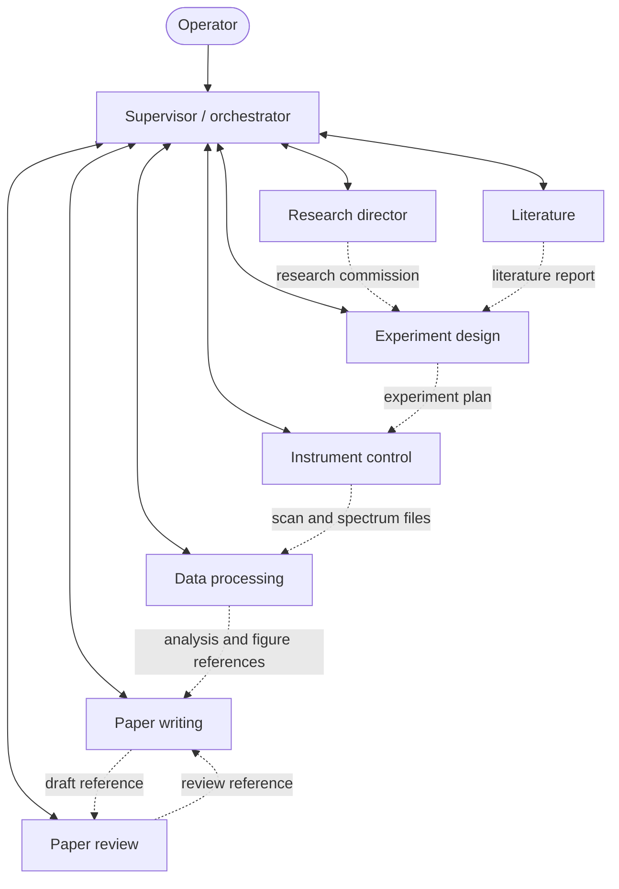

# MAST — agent collaboration and state flow

MAST connects research planning, instrument execution, data analysis and writing
through an orchestrator and shared artifact contracts. This map describes the
retained implementation in the public 6.5.0 source edition. Start with
[the repository guide](../../AGENTS.md) for execution boundaries and validation.
Paths in code spans below are relative to the repository root.

## Routing and work products

The agent roster is declared in `MASTv2/mast/agents/_shared/roster.py` and assembled
by `MASTv2/mast/agents/orchestrator/graph.py`. The diagram separates control flow
from an example sequence of work products; it is not a fixed execution pipeline.

Solid links represent dispatch and return through the supervisor. Dashed links
show example artifact dependencies, not direct graph edges. In the LangGraph
path, `MASTv2/mast/agents/_shared/handoff.py::make_handoff` returns control to the parent
supervisor and records an intended destination in `routing_hints`. This lets
the supervisor apply its routing, loop and budget checks on each handoff.
Independent work can be dispatched together; access to the physical instrument
also has a separate process-local ownership token.

| Agent ID | Responsibility | Implementation entry |
|---|---|---|
| `research_director` | Frame a research programme, inspect previous products and commission experiments. Campaign-related extensions remain experimental. | `MASTv2/mast/agents/research_director/graph.py` |
| `literature` | Search configured literature sources and produce a report. The public edition includes the code, not a preloaded corpus. | `MASTv2/mast/agents/literature/graph.py` |
| `experiment_design` | Turn the research question and available evidence into an experiment plan. | `MASTv2/mast/agents/experiment_design/graph.py` |
| `instrument_control` | Expose instrument skills through the agent tool adapter and execute planned measurements. | `MASTv2/mast/agents/instrument_control/graph.py` |
| `data_processing` | Analyse saved scan and spectroscopy files and record results. Paper-derived tools excluded from this release are not part of its public tool list. | `MASTv2/mast/agents/data_processing/graph.py` |
| `paper_writing` | Assemble document sections from reports, analysis, figures and experiment records. | `MASTv2/mast/agents/paper_writing/graph.py` |
| `paper_review` | Review a draft against its methods, data and citations, and return a review product. | `MASTv2/mast/agents/paper_review/graph.py` |

Each domain agent's adjacent `prompts.py` and `tools.py` explain its instructions
and available operations. Prompts express intended behaviour; executable gates,
tool implementations and tests establish how that behaviour is enforced.
The [skill catalog](skill-catalog.md) is a generated inventory, not a guarantee
that every listed skill is enabled or visible to an agent in a given session.

## Artifacts across the parent/subgraph boundary

`MASTv2/mast/agents/state.py` defines shared state and its merge rules. The product
types live in `MASTv2/mast/agents/_shared/artifact_types.py`: `DocRef` carries
document identity, version, path and a bounded summary; scan and analysis products
carry paths and structured metadata. Full document bodies and measurement arrays
stay outside these artifact fields.

| State field | Product represented |
|---|---|
| `research_campaign` | Research commission and programme reference |
| `literature_report` | Literature report reference |
| `experiment_plan` | Experiment plan reference |
| `last_scan`, `scan_id` | Latest measurement reference and identity |
| `analysis` | Analysis summary, metrics, figure paths and anomalies |
| `draft` | Draft document reference |
| `review` | Review document reference |

`artifact_channel.CARRIED_FIELDS` specifies which products cross the parent
boundary. `artifact_channel.CONSUMES` specifies which products are presented to
each receiving role by `UpstreamArtifactMiddleware`. Transport and presentation
are separate: a branch can preserve a product without exposing every field to
every agent. State reducers define how concurrent updates combine.

Read `tests/v2/agents/orchestrator/test_artifact_channel.py` alongside these
modules. It checks schema registration, field reducers, product transfer across
real compiled subgraphs, visibility to the next agent and parallel writes, using
test models rather than live providers.

## Observation and operator control

`MASTv2/mast/buffer/service.py` separates observation production from agent reads.
`MASTv2/mast/agents/_shared/buffer_tools.py` exposes the latest tip assessment and
scan progress, including record age and whether the scan line advanced. A changed
global buffer sequence is not evidence that scanning continues.
`MASTv2/mast/agents/buffer_summarizer/node.py` provides a separate summarization
helper; it is not a dispatch target in the domain-agent roster.

The React interface exposes conversations and agent activity through
`frontend/src/pages/ChatPage.tsx` and `frontend/src/pages/AgentsPage.tsx`.
`MASTv2/mast/api/routes/orchestrator.py` provides run and control endpoints.
SSE terminal frames distinguish completion from a broken stream; WebSocket
reconnection and polling fallback support observation updates after a transport
interruption. See the streaming route in [AGENTS.md](../../AGENTS.md).

## Execution gates, budgets and runtime selection

- Agent tools, the manual executor and `ExecutionContext` have distinct outer
  entry points. They share parameter checks, mode decisions, instrument ownership
  and abort handling; see `core/safety.py`, `core/instrument_lock.py` and
  `agents/_shared/skill_adapter.py` under `MASTv2/mast/`.
- A skill's `AUTO`, `CONFIRM` or `DANGEROUS` metadata does not by itself determine
  whether a modal opens. Effective handling also depends on operating mode,
  parameters, approval provenance and active interlocks. The source is the
  authority for a particular operation.
- Call limits distinguish a single run from a conversation's lifetime. Inspect
  `MASTv2/mast/agents/_shared/call_limits.py`, the runtime's selected settings and
  the supervisor's guards rather than assuming one fixed limit for every agent.
- The experimental `MASTv2/mast/agentruntime/` implementation coexists with the
  LangGraph path. `engine_v2_*` settings default off; trace their selectors before
  attributing runtime behaviour to that implementation. Its hardware validation
  remains pending, as described in [the snapshot notes](../OPEN_SOURCE_NOTES.md).

Further regression entry points are
`tests/v2/agents/orchestrator/test_parallel_dispatch.py`,
`tests/v2/unit/core/test_execution_context_mode_gate.py`,
`tests/v2/unit/agents/test_scan_progress_liveness.py` and
`tests/v2/unit/agents/test_call_limit_semantics.py`.
